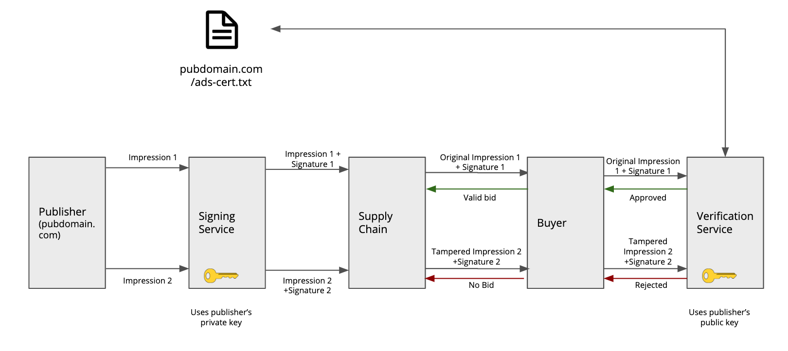

# Verification Service for Signed Bid Requests

Ad Fraud has always been a big problem in the ad industry. Inventory spoofing is a problem that still exists where a request can be modified by any entity in the supply chain to pose it as premium inventory. This is the problem which ads.cert tries to solve.

## How ads.cert works?

 - The publisher or the signing authority maintains the private key
 - A small set of essential fields (DsMap) and values in the request is used to generate the digest
 - The Signing Service generates the Digital Signature (ds) using the digest and the private key
 - The request is sent to the Exchanges/DSPs including the Digital Signature, DsMap and other fields
 - The Signature Verification Service creates a new digest from the request it receives using the fields present in the DsMap and the respective values
 - The digest and the public key (hosted on publisher domain) are then used to verify the Digital Signature present in the OpenRTB request using ECDSA SHA 256 algorithm



Read about Ads.Cert - Signed Bid Requests here: [IAB Ads.Cert](https://github.com/InteractiveAdvertisingBureau/openrtb/blob/master/ads.cert:%20Signed%20Bid%20Requests%201.0%20BETA.md)

## Goal of this library:

To allow for fast-track on-boarding for ads.cert, media.net is offering the verification service as an open-source solution. Following are the features supported:

 - Digital Signature Verification (via OpenRTB 3.0 object or Digest or Map of key-values)
 - Sampling
 - Message Expiry checks
 - Offline Verification
 - Reporting hooks
 - In-memory caching to minimize latencies

## Usage

Instantiate an object of ``` VerificationService ``` to access the methods for verifying the request. The class VerificationService is thread-safe and can be used as a singleton.

### Examples

 - Verification via Open RTB object
    ```java
    OpenRTB openRTB = ...  // Construct open RTB object 
 
    // Approach 1: Non-Debug Mode (Digest will be created using fields present 
    // in dsMap present at openrtb.request.source.dsmap).
    VerificationService service = new VerificationService();
    service.verifyRequest(openRTB); // or service.verifyRequest(openRTB, true);
 
    // Approach 2: Debug Mode: Digest present at openrtb.request.source.digest
    // will be used. DsMap will not be used for digest creation.
    service.verifyRequest(openRTB, false);
 
    // Approach 3: If Public Key object is already available for verification.
    service.verifyRequest(openRTB, false, publicKey);
    ```
    
 - Verification via key-value map of fields
   
   In this case, the entire open RTB object need not be created. Simply pass, in a map, values against field names for creating digest and running verification. Along with this map, dsMap must be passed to enforce the order in which the fields from the map will be processed.
   ```java
   Map<String, String> map = new LinkedHashMap<>(); 
   // Put values
    map.put("domain", "newsite.com");
    map.put("ft", "d");
    map.put("tid", "ABC7E92FBD6A");
 
    String dsMap = "domain=&ft=&tid=";
    String publicKeyUrl = "http://www.newsite.com/ads.cert";
    String ds = ... // digital signature to be verified.
    
    // Approach 1: Using Public Key URL.
    VerificationService service = new VerificationService();
    service.verifyRequest(publicKeyUrl, map, ds, map);
    
    // Approach 2: If Public Key object is already available for verification.
    service.verifyRequest(publicKey, map, ds, map);
   ```
   ***Note:***
   Only the following fields are supported in this approach:
   
   | Key | Spec    | Object         | Example Value  |
   |------------------|---------|----------------|----------------|
   | tid              | OpenRTB | Source         | ABC7E92FBD6A   |
   | ts               | OpenRTB | Source         |                |
   | cert             | OpenRTB | Source         | ads-cert.1.txt |
   | domain           | AdCOM   | Site           | newsite.com    |
   | bundle           | AdCOM   | App            |                |
   | consent          | AdCOM   | User           |                |
   | ft               | AdCOM   | -              | vd             |
   | ip               | AdCOM   | Device         | 192.168.1.1    |
   | ipv6             | AdCOM   | Device         |                |
   | ifa              | AdCOM   | Device         |                |
   | ua               | AdCOM   | Device         |                |
   | w                | AdCOM   | VideoPlacement | 480            |
   | h                | AdCOM   | VideoPlacement | 360            |

## Features

### Sampling

Aditionally, a sampling percentage can be provided during instantiation to control the percentage of requests for which verification is desired. The default value of sampling percentage is 100, which means that all requests will be verified.

```java
int samplingPercentage = 50; // Sampling Percentage is 50.
VerificationService service = new VerificationServiceJCache(samplingPercentage);
```

### Message Expiry

Support has also been provided to optionally check message expiry. The timestamp in OpenRTB is assumed to be the time elapsed since UTC epoch. If the difference between timestamp in the OpenRTB request and current system timestamp exceeds a pre-defined margin, the service will fail the verification.

```java
int samplingPercentage = 50; // Sampling Percentage is 50.
long messageExpiryTimeInMillis = 2000l; // Message should be received under 2 seconds.
new VerificationService(samplingPercentage, messageExpiryTimeInMillis).verifyRequest(openRTB, debug, publicKey, checkMessageExpiry);
```

### Metrics and Reporting

A reporting hook through ``` MetricsManager ``` has been provided for collecting and pushing metrics to a suitable data sink. One can pass an implementation of ``` MetricsManager ``` to the constructor of ``` VerificationService ``` as below:

```java
MetricsManager metricsManager = new MetricsManager();
VerificationService service = new VerificationServiceJCache(metricsManager);

// with custom sampling and message expiry time
int samplingPercentage = 50; // Sampling Percentage is 50.
long messageExpiryTimeInMillis = 2000l; // Message should be received under 2 seconds.
VerificationService serviceWithCustomSamplingAndExpiry = new VerificationService(samplingPercentage, messageExpiryTimeInMillis, metricsManager);
```

 Refer to the sequence diagram in the wiki here: [Non Cache Sequence Diagram](https://github.com/media-net/ads-cert-openrtb3-verifier/wiki/Sequence-Diagrams#non-cache)

### Cache

We have also provided the functionality to fetch and cache the Public Keys for different domains, thus saving time required for verification. Cache will expire after a preconfigured time (default 30 days). Two different cache implementations, using JCache and Guava, are provided for VerificationService. The corresponding classes are ``` VerificationServiceJCache ``` and ``` VerificationServiceGuavaCache ```.

Additionally, default implementations for both caches are also provided. Either can be used or a custom cache object can be passed to the constructor.

***JCache:***

```java
Cache<String, PublicKey> cache = DefaultJCacheBuilder.newBuilder()
                                       .setExpiryForAccess(...)
                                       .setExpiryForCreation(...)
                                       .setExpiryForUpdate(...)
                                       .setCacheLoader(...)
                                       .build();
// without sampling and message expiry                                       
VerificationServiceJCache service = new VerificationServiceJCache(cache);

// with custom sampling
int samplingPercentage = 50; // Sampling Percentage is 50.
VerificationServiceJCache serviceWithCustomSampling = new VerificationServiceJCache(cache, samplingPercentage);

// with custom message expiry
long messageExpiryTimeInMillis = 2000l; // Message should be received under 2 seconds.
VerificationServiceJCache serviceWithCustomSamplingAndExpiry = new VerificationServiceJCache(cache, samplingPercentage, messageExpiryTimeInMillis);

// with Metrics Manager
MetricsManager metricsManager = new MetricsManager();
VerificationServiceJCache serviceWithMetricSupport = new VerificationServiceJCache(cache, samplingPercentage, messageExpiryTimeInMillis, metricsManager);
```

Refer to the sequence diagram in the wiki here: [JSR 107 Cache Sequence Diagram](https://github.com/media-net/ads-cert-openrtb3-verifier/wiki/Sequence-Diagrams#jsr-107-cache)

***Guava:***

```java
Cache<String, PublicKey> cache = DefaultGuavaCacheBuilder.newBuilder()
                                        .setMaximumSize(...)
                                        .setExpireAfterAccess(...)
                                        .setExpireAfterWrite(...)
                                        .build();

VerificationServiceGuavaCache service = new VerificationServiceGuavaCache(cache);

// with custom sampling
int samplingPercentage = 50; // Sampling Percentage is 50.
VerificationServiceGuavaCache serviceWithCustomSampling = new VerificationServiceJCache(cache, samplingPercentage);

// with custom message expiry
long messageExpiryTimeInMillis = 2000l; // Message should be received under 2 seconds.
VerificationServiceGuavaCache serviceWithCustomSamplingAndExpiry = new VerificationServiceJCache(cache, samplingPercentage, messageExpiryTimeInMillis);

// with Metrics Manager
MetricsManager metricsManager = new MetricsManager();
VerificationServiceGuavaCache serviceWithMetricSupport = new VerificationServiceGuavaCache(cache, samplingPercentage, messageExpiryTimeInMillis, metricsManager);
```

Refer to the sequence diagram in the wiki here: [GUAVA Cache Sequence Diagram](https://github.com/media-net/ads-cert-openrtb3-verifier/wiki/Sequence-Diagrams#guava-cache)

Both the default cache builders have default values set for fields. For example, one can write ``` DefaultGuavaCacheBuilder.newBuilder().build() ```
and it will return a cache created with parameters set to default values.


### Offline Bulk verification

Bulk verification can be performed by passing the path to the input file containing JSONs of OpenRTB requests (each line has complete json of one request), along with the path to the file to which output should be written.

```java
FileVerificationService.verify("input.txt", "output.txt");
```

## Assumptions
 - Comments in the ads.cert file are not supported
 - Metric collection and reporting are not supported in debug mode (i.e. when the supplied digest is used for verification instead of creating it)

## Exception Handling

| Scenario | Exception | Comment
| ------ | ------ | ------ |
| openrtb.request.source.digest == null | InvalidDataException: OpenRtb.source.digest: may not be null | Raised only in debug mode |
| validation of dsmap in Open RTB fails | InvalidDataException: OpenRtb.source.dsmap: bad dsmap provided | Raised only when the verification is run on open RTB object |
| dsmap validation fails when executed only on map of fields to values | InvalidDataException: bad dsmap provided | Raised only when the verification is run on the map of fields to values |
| Message has expired | ProcessException: Message has expired. Time Difference (in millis):... |
| openrtb == null | InvalidDataException: OpenRTB object is null |
| openrtb.request == null | InvalidDataException: OpenRTB.Request object is null |
| openrtb.request.source == null | InvalidDataException: OpenRTB.Request.Source is null |

## Requirements
Java 8
