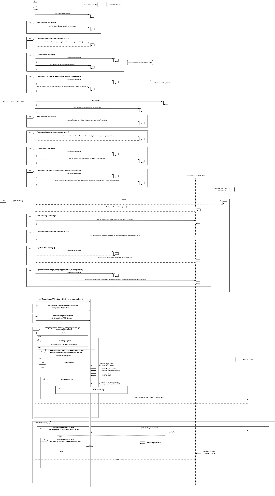

# Verification Service for Signed Bid Requests

Read about Ads.Cert - Signed Bid Requests here: [IAB Ads.Cert](https://github.com/InteractiveAdvertisingBureau/openrtb/blob/master/ads.cert:%20Signed%20Bid%20Requests%201.0%20BETA.md)

This service can be used for verification of the digital signature in ORTB requests by checking whether the values of the fields using which the signature was created were forged or not.

## Usage

Instantiate an object of ``` VerificationService ``` to access the methods for verifying the request. The class VerificationService is thread-safe, and can be used as a singleton. 

## Features

### Sampling

Aditionally, a sampling percentage can be provided while instantiation to control the percentage of requests for which verification is desired. The default value of sampling percentage is 100, which means that all requests will be verified.

```java
int samplingPercentage = 50; // Sampling Percentage is 50.
VerificationService service = new VerificationServiceJCache(samplingPercentage);
```

### Message Expiry

Support has also been provided to optionally check message expiry. The timestamp in OpenRTB is assumed to be the time elapsed since UTC epoch. If the difference between timestamp in the OpenRTB request and current system timestamp exceeds a pre-defined margin, the service will fail the verification.

```java
int samplingPercentage = 50; // Sampling Percentage is 50.
long messageExpiryTimeInMillis = 2000l; // Message should be received under 2 seconds.
new VerificationService(samplingPercentage, messageExpiryTimeInMillis).verifyRequest(OpenRTB openRTB, Boolean debug, PublicKey publicKey, boolean checkMessageExpiry
```

### Metrics and Reporting

A reporting hook through ``` MetricsManager ``` has been provided for collecting and pushing metrics to a suitable data sink. One can pass an implementation of ``` MetricsManager ``` to the constructor of ``` VerificationService ``` as below:

```java
MetricsManager metricsManager = new MetricsManager();
VerificationService service = new VerificationServiceJCache(metricsManager);

// with custom sampling and message expiry time
int samplingPercentage = 50; // Sampling Percentage is 50.
long messageExpiryTimeInMillis = 2000l; // Message should be received under 2 seconds.
VerificationService serviceWithCustomSamplingAndExpiry = new VerificationService(samplingPercentage, messageExpiryTimeInMillis, metricsManager);
```

### Cache

Two more implementations are provided for VerificationService which support the use of caches such as JCache and Guava. The cache stores the Public Keys fetched from ads.cert files from different domains. The corresponding classes are ``` VerificationServiceJCache ``` and ``` VerificationServiceGuavaCache ```. 

Additionally, default implementations for both caches are also provided. You can either use them or pass your own cache object to the constructor.

***JCache:***

```java
Cache<String, PublicKey> cache = DefaultJCacheBuilder.newBuilder()
                                       .setExpiryForAccess(...)
                                       .setExpiryForCreation(...)
                                       .setExpiryForUpdate(...)
                                       .setCacheLoader(...)
                                       .build();
// without sampling and message expiry                                       
VerificationServiceJCache service = new VerificationServiceJCache(cache);

// with custom sampling
int samplingPercentage = 50; // Sampling Percentage is 50.
VerificationServiceJCache serviceWithCustomSampling = new VerificationServiceJCache(cache, samplingPercentage);

// with custom message expiry 
long messageExpiryTimeInMillis = 2000l; // Message should be received under 2 seconds.
VerificationServiceJCache serviceWithCustomSamplingAndExpiry = new VerificationServiceJCache(cache, samplingPercentage, messageExpiryTimeInMillis);

// with Metrics Manager
MetricsManager metricsManager = new MetricsManager();
VerificationServiceJCache serviceWithMetricSupport = new VerificationServiceJCache(cache, samplingPercentage, messageExpiryTimeInMillis, metricsManager);
```

***Guava:***

```java
Cache<String, PublicKey> cache = DefaultGuavaCacheBuilder.newBuilder()
                                        .setMaximumSize(...)
                                        .setExpireAfterAccess(...)
                                        .setExpireAfterWrite(...)
                                        .build();

VerificationServiceGuavaCache service = new VerificationServiceGuavaCache(cache);

// with custom sampling
int samplingPercentage = 50; // Sampling Percentage is 50.
VerificationServiceGuavaCache serviceWithCustomSampling = new VerificationServiceJCache(cache, samplingPercentage);

// with custom message expiry 
long messageExpiryTimeInMillis = 2000l; // Message should be received under 2 seconds.
VerificationServiceGuavaCache serviceWithCustomSamplingAndExpiry = new VerificationServiceJCache(cache, samplingPercentage, messageExpiryTimeInMillis);

// with Metrics Manager
MetricsManager metricsManager = new MetricsManager();
VerificationServiceGuavaCache serviceWithMetricSupport = new VerificationServiceGuavaCache(cache, samplingPercentage, messageExpiryTimeInMillis, metricsManager);
```

Both the default cache builders have default values set for fields. For example, one can write ``` DefaultGuavaCacheBuilder.newBuilder().build() ``` 
and it will return a cache created with parameters set to default values.


### Bulk verification

Bulk verification can be performed by passing the path to the input file containing JSONs of OpenRTB requests (each line has complete json of one request), along with the path to the file to which output should be written.

```java
FileVerificationService.verify("input.txt", "output.txt");
```

## Requirements
Java 8

## Flow




